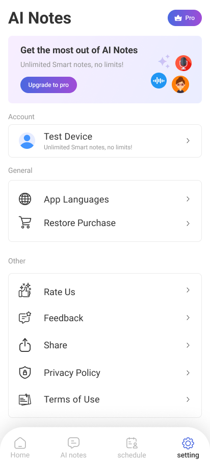

# NotesTakingApp

Starter Android notes app scaffold built with Kotlin + Jetpack Compose + Room.

## Harness Engineering

This project utilizes a "Harness Engineering" approach for UI development. This involves iteratively refining the user interface to match the design specifications as closely as possible. 

The process involves:
1. Taking the original UI design mockups.
2. Implementing the UI using Jetpack Compose.
3. Running automated UI tests to capture screenshots of the rendered implementation.
4. Comparing the rendered screenshots against the original design.
5. Iterating on the Compose code to fix alignment, colors, typography, and spacing.
6. Repeating the process until the rendered UI closely matches the original design.

### Example: Settings Screen

Below is an example of the Harness Engineering process applied to the Settings screen.

**Original Design:**

**Rendered Implementation (After Iterations):**

