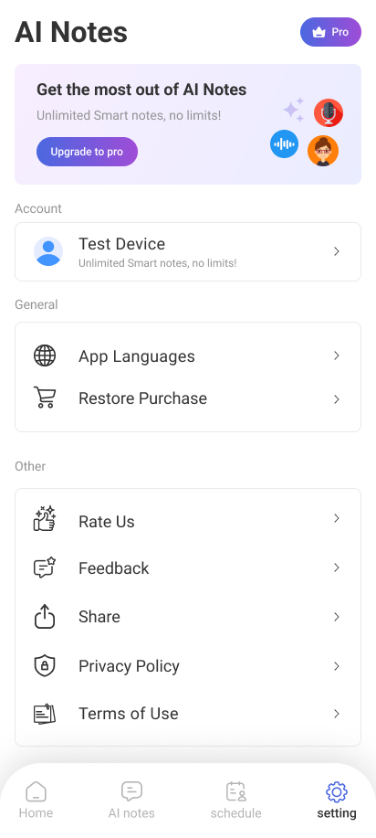
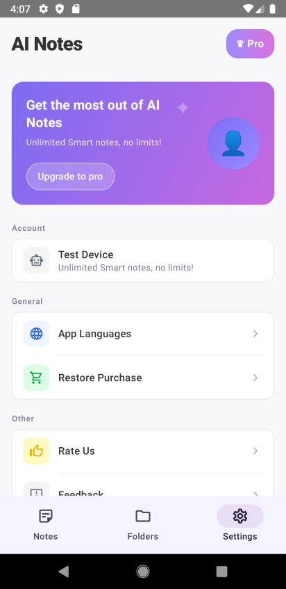

# NotesTakingApp — Agent Harness

This repository uses a structured **agent harness** — a set of workflows, stages, rules, and skills that guide AI coding agents to deliver production-quality changes safely and consistently.

This README explains how to set up and use the harness with different coding tools.

---

## Quick Start for Agents

**Antigravity IDE** injects `AGENTS.md` automatically — skip to step 2.
All other tools (Codex CLI, Claude, Cursor, Windsurf, Copilot Chat) must load context manually first.

1. **Load context** — Prompt: `Load context for the project` (uses `skills/context-management/`). *(Skip if using Antigravity — already injected.)*
2. **Pick a workflow** from `.agents/workflows/` that matches your task
3. **Follow the workflow stages** — each stage tells you what to load next and what gate to pass before advancing

Do not load all rules and skills upfront. Load only what the current stage requires.


---

## Feature Delivery Workflow

The diagram below shows the standard pipeline for delivering a new feature. The ⛔ markers are **mandatory human approval gates** — the agent stops and waits before advancing.

```
┌─────────────────────────────────────┐
│   📋 Requirement, Impact & Design   │ ◄───────────────────────┐
└──────────────────┬──────────────────┘                          │
                   │                                             │
                   ▼                                             │
┌─────────────────────────────────────┐                          │
│  📝 Implementation Plan  ⛔ STOP   │ ── plan rejected ────────┘
└──────────────────┬──────────────────┘
                   │  approved
                   ▼
┌─────────────────────────────────────┐
│  ⚙️  Implementation                 │ ◄───────────────────────┐
│     Data · Domain · UI              │                          │
└──────────────────┬──────────────────┘                          │
                   │                                             │
                   ▼                                             │
┌─────────────────────────────────────┐                          │
│  🧪 Testing                         │ ◄───────────────────────┐│
│     Unit · Integration · UI         │ ── test failure ─────────┘│
└──────────────────┬──────────────────┘                          │
                   │                                             │
                   ▼                                             │
┌─────────────────────────────────────┐                          │
│  🔍 Code + Test Review  ⛔ STOP     │ ── violation found ──────┘
└──────────────────┬──────────────────┘
                   │  approved
                   ▼
┌─────────────────────────────────────┐
│  📚 Knowledge Capture               │
└─────────────────────────────────────┘
```

---

## Harness Structure


```
.agents/
├── AGENTS.md              ← Start here every session. Root map of the harness.
├── workflows/             ← Pick one per task. Entry point for all coding work.
│   ├── harness-planning.md
│   ├── harness-generator.md
│   ├── harness-evaluation.md
│   ├── feature-delivery.md
│   ├── feature-review.md
│   ├── bug-fixing.md
│   ├── create-ui-and-verify.md
│   └── api-contract-update.md
├── stages/                ← Step-by-step processes invoked by workflows.
│   ├── requirement-analysis.md
│   ├── implementation-plan.md
│   ├── implementation.md
│   ├── data-layer.md
│   ├── domain-layer.md
│   ├── ui-layer.md
│   ├── ui-verification.md
│   ├── testing.md
│   ├── review.md              ← Single evaluator pass covering implementation + tests
│   ├── knowledge-capture.md
│   └── bug-reproduction.md
├── rules/                 ← Mandatory constraints. L1 = always loaded. L3 = on-demand.
│   ├── android-architecture.md   ← L1: load every session
│   ├── testing-strategy.md       ← L1: load every session
│   ├── compose-rules.md          ← L3: load when UI changes
│   ├── api-contract-rules.md     ← L3: load when API layer changes
│   ├── navigation-rules.md       ← L3: load when navigation changes
│   ├── localization-rules.md     ← L3: load when strings change
│   └── analytics-rules.md        ← L3: load when analytics events change
├── skills/                ← How-to guides. Loaded per stage (L2), not all at once.
│   ├── spec-driven-development/
│   ├── incremental-implementation/
│   ├── android-ui-verification/
│   ├── android-unit-test/
│   ├── android-instrumented-ui-test/
│   ├── android-integration-test/
│   ├── shared-json-scenarios/
│   ├── android-code-quality-checks/  ← Code Review step 1: run tools
│   ├── code-review-and-quality/      ← Code Review step 2: reasoning review
│   ├── security-and-hardening/
│   ├── documentation-and-adrs/
│   ├── karpathy-guidelines/
│   ├── context-management/
│   ├── test-driven-development/
│   └── shipping-and-launch/
├── gates/                 ← CI checklists. Must pass before advancing stages.
└── docs/
    ├── knowledge/         ← Past bugs, pitfalls, architecture decisions (load on-demand).
    ├── changes/           ← Audit trail — one directory per delivered change.
    └── templates/         ← Standard output formats for plans, reviews, and tests.
```

---

## Workflows

Pick the workflow that matches your task:

| Workflow | When to use |
|---|---|
| `harness-planning.md` | Complex feature that needs slicing into tasks before implementation |
| `harness-generator.md` | Implement features step-by-step using the harness-generator pipeline |
| `harness-evaluation.md` | Code review + test review of an existing change |
| `feature-delivery.md` | New feature, enhancement, or API integration |
| `feature-review.md` | Independent review of an existing change and fixing all findings before merge |
| `bug-fixing.md` | Bug, crash, regression, or unexpected behavior |
| `create-ui-and-verify.md` | UI implementation or update from a design |
| `api-contract-update.md` | Backend API contract change |

---

## Context Loading Strategy

The harness uses three context layers to keep the agent context window below 40% fill:

| Layer | When | What |
|---|---|---|
| **L1 — Always** | Every session | `AGENTS.md` + `rules/android-architecture.md` + `rules/testing-strategy.md` |
| **L2 — Per stage** | As stages advance | The skill(s) listed in the current stage's **Load** section |
| **L3 — On demand** | When needed | `docs/knowledge/`, specific `rules/` files, `sharedContracts/openapi.yaml` |

**Do not preload everything.** Load what the current stage requires, nothing more.

---

## Build Commands

```bash
./gradlew assembleDebug              # build check
./gradlew testDebugUnitTest          # unit + integration tests
./gradlew koverLog                   # coverage (must be ≥ 80% overall)
./gradlew ktlintCheck                # formatting check
./gradlew ktlintFormat               # auto-fix formatting
./gradlew detekt                     # static analysis
./gradlew connectedDebugAndroidTest  # instrumented UI tests (when UI changed)
```

---

## Distribution

```bash
./gradlew appDistributionUploadDebug     # Debug build → Firebase App Distribution
./gradlew appDistributionUploadRelease   # Release build → Firebase App Distribution
```

---

## UI Verification Process

The harness includes a pixel-accurate UI verification workflow. When a UI change is made:

1. Reference the design mockup from `UX/`
2. Implement in Jetpack Compose
3. Run instrumented UI tests to capture screenshots
4. Compare rendered output against the mockup using `stages/ui-verification.md`
5. Iterate on layout, colors, typography, and spacing until they match

| Design | Rendered |
|--------|----------|
|  |  |

---

## API Contract

The backend contract lives in `sharedContracts/openapi.yaml` and is the single source of truth for DTO shapes. Shared JSON test scenarios in `sharedContracts/test-scenarios/` are consumed by both Android integration tests and the backend test suite.
